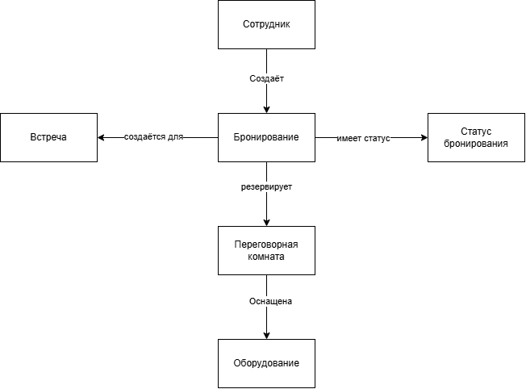

Лабораторная работа №1
Анализ предметной области информационной системы

Вариант 3. Система бронирования переговорных комнат.
## 1. Описание предметной области
В организациях переговорные комнаты нужны для проведения совещаний, рабочих встреч, переговоров и видеоконференций.
В одном офисе может быть несколько таких комнат, при этом они отличаются друг от друга вместимостью, расположением и имеющимся оборудованием.
Когда сотруднику нужно провести встречу, ему необходимо найти подходящую свободную комнату на определённые дату и время. 
При выборе помещения важно учитывать количество участников. В некоторых случаях также имеет значение оборудование, например проектор, телевизор, камера и так далее.
Если единой системы бронирования нет, информация о занятости комнат может находиться в разных местах. 
Например, часть сотрудников использует календарь, часть договаривается в переписке, кто-то сообщает о занятой комнате устно.
Из-за этого может возникнуть ситуация, когда одну комнату несколько человек планируют использовать одновременно.
Система бронирования переговорных комнат должна упростить этот процесс. 
Сотрудник сможет посмотреть информацию о комнатах, узнать, какие из них свободны, и забронировать подходящее помещение. 
Администратор сможет изменять информацию о переговорных комнатах и указывать, если какая-либо из них временно недоступна.

## 2. Проблема и цель системы
### Проблема
Основная проблема заключается в том, что без единой системы сложно получить актуальную информацию о занятости переговорных комнат. 
Если сотрудники используют разные способы бронирования, могут возникать пересечения, когда на одно и то же помещение и время рассчитывают несколько человек.
Также сотруднику не всегда заранее известно, подходит ли комната по вместимости и есть ли в ней необходимое оборудование. 
Отдельная проблема возникает, если помещение временно нельзя использовать, например из-за ремонта, но информация об этом не была передана всем сотрудникам.
### Цель
Целью является создание концепции информационной системы, с помощью которой сотрудники смогут просматривать переговорные комнаты, находить свободные помещения и бронировать их на определённое время.
Система должна сделать процесс бронирования более удобным, уменьшить количество конфликтов и хранить информацию о комнатах и их занятости в одном месте.
### Область применения
Система предполагается для использования внутри организации, в которой имеется несколько переговорных комнат.
Она может применяться сотрудниками при организации совещаний, рабочих встреч, переговоров и других мероприятий.

## 3. Анализ предметной области
В данной предметной области можно выделить несколько основных объектов:
1. Сотрудник
Сотрудник является пользователем системы и может создавать бронирования переговорных комнат.
Основные характеристики:
- ID сотрудника
- ФИО
- электронная почта
- должность
- роль в системе

2. Переговорная комната
Переговорная комната представляет собой помещение, которое сотрудники могут использовать для встреч.
Основные характеристики:
- ID комнаты
- номер или название
- расположение
- вместимость
- описание
- доступность

3. Бронирование
Бронирование показывает, какая комната, кем и на какое время была занята.
Основные характеристики:
- номер бронирования
- дата
- время начала
- время окончания
- сотрудник
- переговорная комната
- статус бронирования

4. Встреча
Встреча содержит основную информацию о мероприятии, для которого бронируется помещение.
Основные характеристики:
- тема встречи
- описание
- количество участников
- дата проведения

5. Оборудование
Оборудование показывает, какие технические средства имеются в переговорной комнате. Например, это может быть проектор, телевизор, камера, микрофон и так далее.
Основные характеристики:
- ID оборудования
- название
- тип
- состояние

6. Статус бронирования
Статус показывает текущее состояние бронирования. Например, бронирование может быть активным или отменённым.
Основные характеристики:
- ID статуса
- название
- описание

###Связи между объектами
Сотрудник создаёт бронирование. Каждое бронирование связано с определённой переговорной комнатой и встречей, а также имеет свой статус. 
Переговорная комната может быть оснащена различным оборудованием.
Одна переговорная комната может использоваться много раз, поэтому у неё может быть несколько бронирований на разные промежутки времени. 
При этом активные бронирования одной комнаты не должны пересекаться по времени.

## 4. Пользователи и роли
1. Сотрудник
Сотрудник является основным пользователем системы. Он использует её для поиска и бронирования переговорных комнат.
Сотрудник может просматривать комнаты и их характеристики, проверять свободное время, выбирать помещение по вместимости и оборудованию, создавать бронирование, просматривать свои бронирования и при необходимости отменять их.

2. Администратор переговорных комнат
Администратор отвечает за информацию о помещениях.
Он может добавлять новые переговорные комнаты, изменять их характеристики, вместимость и оборудование, а также временно делать комнату недоступной.
Например, если помещение закрыто на ремонт, администратор указывает это в системе, после чего сотрудники не смогут его забронировать.

3. Системный администратор
Системный администратор отвечает за пользователей системы и их права. Он может добавлять пользователей, блокировать и разблокировать учётные записи, а также изменять роли пользователей.

## 5. Функциональные требования
FR-01. Система должна позволять сотруднику просматривать список переговорных комнат.
FR-02. Система должна отображать информацию о переговорной комнате, включая её расположение, вместимость, доступность и имеющееся оборудование.
FR-03. Система должна позволять сотруднику искать переговорные комнаты, свободные на выбранные дату и время.
FR-04. Система должна позволять сотруднику отбирать переговорные комнаты по минимально необходимой вместимости.
FR-05. Система должна позволять сотруднику отбирать переговорные комнаты по наличию необходимого оборудования.
FR-06. Система должна позволять сотруднику просматривать расписание бронирований выбранной переговорной комнаты.
FR-07. Система должна позволять сотруднику создавать бронирование переговорной комнаты с указанием даты, времени начала и времени окончания.
FR-08. Система должна позволять сотруднику при создании бронирования указывать тему встречи и количество участников.
FR-09. Перед созданием бронирования система должна проверять отсутствие другого активного бронирования выбранной переговорной комнаты на пересекающийся промежуток времени.
FR-10. При обнаружении пересечения по времени система не должна создавать новое бронирование выбранной переговорной комнаты.
FR-11. Система должна позволять сотруднику просматривать созданные им бронирования.
FR-12. Система должна позволять сотруднику отменять созданные им активные бронирования.
FR-13. Система должна позволять администратору переговорных комнат добавлять новые переговорные комнаты.
FR-14. Система должна позволять администратору переговорных комнат изменять сведения о переговорной комнате, включая её название, расположение и вместимость.
FR-15. Система должна позволять администратору переговорных комнат изменять перечень оборудования, указанного для переговорной комнаты.
FR-16. Система должна позволять администратору переговорных комнат изменять доступность переговорной комнаты для бронирования.
FR-17. Система должна позволять системному администратору создавать, блокировать и разблокировать учётные записи пользователей.
FR-18. Система должна предоставлять пользователю только те действия, которые разрешены его ролью в системе.

## 6. Концепция информационной системы
### Назначение
Система предназначена для бронирования переговорных комнат внутри организации.
С её помощью сотрудники смогут узнать, какие помещения имеются в организации, посмотреть их характеристики и занятость, а затем выбрать и забронировать подходящую комнату.

### Основные возможности
Основными возможностями системы являются просмотр переговорных комнат, поиск свободного помещения, выбор комнаты по вместимости и оборудованию, просмотр расписания, создание и отмена бронирований.
Также система должна позволять администраторам управлять информацией о помещениях и пользователях.

### Тип системы
Систему предлагается реализовать в виде веб-приложения.
Такой вариант удобен для внутренней системы организации, поскольку сотруднику будет достаточно открыть её в браузере, а устанавливать отдельную программу на каждый компьютер не потребуется.
Разрабатываемую систему можно отнести к корпоративным информационным системам, так как она используется внутри организации и автоматизирует внутренний процесс бронирования помещений.

### Основные компоненты
Основными компонентами системы будут пользователи, веб-интерфейс, серверная часть и база данных.
Через веб-интерфейс сотрудник будет взаимодействовать с системой. Серверная часть будет обрабатывать запросы и выполнять необходимые проверки. Например, перед созданием бронирования система должна проверить, не занята ли выбранная комната другим сотрудником.
В базе данных должна храниться информация о пользователях, переговорных комнатах, встречах, оборудовании и бронированиях.

### Результат использования
В результате работы системы сотрудник получает возможность быстро найти подходящую переговорную комнату, проверить её доступность на нужные дату и время, ознакомиться с вместимостью и имеющимся оборудованием, а затем создать бронирование. 
После успешного бронирования выбранная комната закрепляется за сотрудником на указанный промежуток времени, а информация о её занятости становится доступна другим пользователям системы.
Использование системы позволяет сотруднику не обращаться к отдельным таблицам, календарям или другим сотрудникам для уточнения доступности помещения, а также снижает вероятность возникновения ситуации, когда одна переговорная комната бронируется несколькими пользователями на одно и то же время.

## 7. Схемы

Для отображения предметной области была выбрана схема, на которой показаны основные объекты и связи между ними.
Основными объектами являются:
- Сотрудник
- Бронирование
- Встреча
- Переговорная комната
- Оборудование
- Статус бронирования

Связи между объектами:
- Сотрудник создаёт Бронирование
- Бронирование относится к Встрече
- Бронирование имеет Статус бронирования
- Бронирование резервирует Переговорную комнату
- Переговорная комната оснащена Оборудованием

## 8. Вывод
В ходе лабораторной работы была рассмотрена предметная область бронирования переговорных комнат в организации.
Основная проблема связана с тем, что без единой системы сотрудникам сложно получать актуальную информацию о занятости помещений, из-за чего могут возникать пересекающиеся бронирования.
В работе были выделены основные объекты предметной области и связи между ними, определены пользователи и их роли, а также сформулированы функциональные требования к будущей системе.
В качестве варианта реализации выбрано веб-приложение, которое позволит сотрудникам искать и бронировать переговорные комнаты, а администраторам поддерживать информацию о помещениях и пользователях в актуальном состоянии.