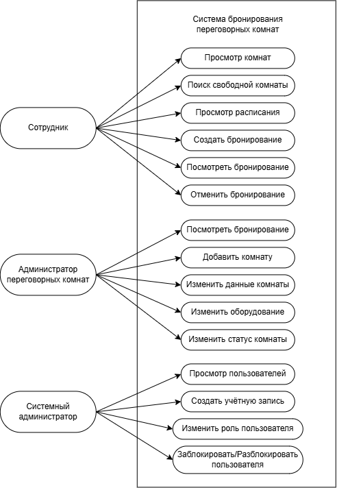
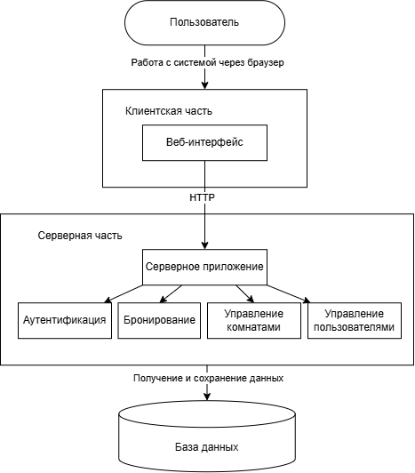

# Лабораторная работа №2
## Проектирование информационной системы

Предметная область: система бронирования переговорных комнат.

## 1. Описание предметной области

В лабораторной работе №1 была рассмотрена система бронирования переговорных комнат внутри организации. Она предназначена для сотрудников, которым необходимо находить и бронировать помещения для проведения совещаний, рабочих встреч, переговоров и видеоконференций.

В организации может находиться несколько переговорных комнат, которые отличаются расположением, вместимостью и имеющимся оборудованием. При выборе помещения сотруднику необходимо учитывать дату и время встречи, количество участников, а в некоторых случаях наличие определённого оборудования, например проектора, телевизора, камеры, микрофона и так далее.

Основная проблема заключается в том, что при отсутствии единой системы информация о занятости переговорных комнат может находиться в разных источниках и быть неактуальной. В результате несколько сотрудников могут рассчитывать на использование одной комнаты в одинаковый период времени.

Информационная система должна предоставлять сотрудникам актуальную информацию о переговорных комнатах, позволять находить свободные помещения и создавать бронирования. Перед сохранением нового бронирования система должна проверять отсутствие другого активного бронирования выбранной комнаты на пересекающийся период.

Кроме сотрудников, с системой работают администратор переговорных комнат и системный администратор. Администратор переговорных комнат отвечает за актуальность сведений о помещениях и их доступности, а системный администратор управляет пользователями и правами доступа.

## 2. Пользователи и роли

В системе выделены три основные роли.

| Роль | Назначение | Основные задачи | Доступные функции | Уровень доступа |
|---|---|---|---|---|
| Сотрудник | Использование переговорных комнат для проведения рабочих встреч | Найти подходящую комнату, проверить её доступность, создать или отменить бронирование | Просмотр переговорных комнат, поиск свободных помещений, просмотр расписания, создание бронирования, просмотр и отмена собственных бронирований | Пользовательский |
| Администратор переговорных комнат | Поддержание актуальной информации о переговорных комнатах | Управление помещениями, их характеристиками, оборудованием и доступностью | Добавление и изменение переговорных комнат, изменение информации об оборудовании, изменение доступности помещений, просмотр бронирований | Расширенный |
| Системный администратор | Управление пользователями и их правами | Создание и обслуживание учётных записей, назначение ролей, управление доступом | Создание пользователей, блокировка и разблокировка учётных записей, изменение ролей и прав доступа | Административный |

## 3. Сценарии использования

### Сценарий 1. Поиск и бронирование переговорной комнаты

**Инициатор:** сотрудник.

**Последовательность действий:**

1. Сотрудник входит в систему.
2. Открывает поиск переговорных комнат.
3. Указывает дату, время и необходимое количество мест.
4. При необходимости выбирает необходимое оборудование.
5. Система показывает подходящие свободные комнаты.
6. Сотрудник выбирает комнату.
7. Указывает тему встречи и количество участников.
8. Система повторно проверяет доступность комнаты.
9. При отсутствии пересечений создаётся бронирование.

**Ожидаемый результат:** переговорная комната забронирована на выбранное время.

### Сценарий 2. Отмена бронирования

**Инициатор:** сотрудник.

**Последовательность действий:**

1. Сотрудник входит в систему.
2. Открывает раздел со своими бронированиями.
3. Система показывает список созданных им бронирований.
4. Сотрудник выбирает активное бронирование.
5. Выбирает действие отмены.
6. Система запрашивает подтверждение.
7. Сотрудник подтверждает отмену.
8. Система изменяет статус бронирования на отменённое.

**Ожидаемый результат:** бронирование отменяется, а соответствующий промежуток времени снова становится доступным для других сотрудников.

### Сценарий 3. Просмотр расписания переговорной комнаты

**Инициатор:** сотрудник.

**Последовательность действий:**

1. Сотрудник входит в систему.
2. Открывает список переговорных комнат.
3. Выбирает интересующую комнату.
4. Открывает её расписание.
5. Система получает данные о действующих бронированиях.
6. Сотруднику отображаются занятые и свободные интервалы времени.

**Ожидаемый результат:** сотрудник получает актуальную информацию о занятости выбранной переговорной комнаты.

### Сценарий 4. Управление переговорной комнатой

**Инициатор:** администратор переговорных комнат.

**Последовательность действий:**

1. Администратор входит в систему.
2. Открывает раздел управления переговорными комнатами.
3. Выбирает существующую комнату или добавляет новую.
4. Указывает или изменяет название, расположение и вместимость.
5. Изменяет информацию об оборудовании.
6. Устанавливает статус доступности.
7. Сохраняет изменения.

**Ожидаемый результат:** информация о переговорной комнате обновляется в системе.

### Сценарий 5. Управление учётной записью пользователя

**Инициатор:** системный администратор.

**Последовательность действий:**

1. Системный администратор входит в систему.
2. Открывает раздел управления пользователями.
3. Находит нужную учётную запись.
4. Выбирает необходимое действие.
5. Изменяет роль пользователя либо блокирует или разблокирует его учётную запись.
6. Сохраняет изменения.

**Ожидаемый результат:** данные пользователя и его права доступа обновляются.

## 4. Диаграмма сценариев использования (Use Case)

На диаграмме представлены три роли: сотрудник, администратор переговорных комнат и системный администратор. Для каждой роли показаны доступные ей сценарии работы с системой.

## 5. Компоненты системы

| Компонент | Назначение | Взаимодействует с |
|---|---|---|
| Веб-интерфейс | Позволяет пользователю работать с системой через браузер | Серверное приложение |
| Серверное приложение | Получает запросы от веб-интерфейса и передаёт их нужным компонентам | Веб-интерфейс, аутентификация, модуль бронирования, модуль управления комнатами, модуль управления пользователями, база данных |
| Аутентификация | Проверяет пользователя и его права | Серверное приложение, база данных |
| Модуль бронирования | Отвечает за создание, просмотр и отмену бронирований | Серверное приложение, база данных |
| Модуль управления комнатами | Работает с информацией о переговорных комнатах, оборудовании и статусе комнат | Серверное приложение, база данных |
| Модуль управления пользователями | Отвечает за учётные записи и роли пользователей | Серверное приложение, база данных |
| База данных | Хранит информацию о пользователях, комнатах и бронированиях | Серверная часть |

## 6. Диаграмма компонентов

На диаграмме показаны веб-интерфейс, API-сервер, основные серверные модули и база данных. Веб-интерфейс взаимодействует с API-сервером по HTTP, после чего запрос передаётся нужному модулю. Серверные модули получают и сохраняют необходимые данные в базе данных.

## 7. Концепция информационной системы

### Назначение и цель системы

Система предназначена для автоматизации бронирования переговорных комнат внутри организации. Её использование должно упростить поиск свободных помещений и снизить вероятность возникновения пересекающихся бронирований.

### Основные возможности

Система должна позволять просматривать переговорные комнаты и их характеристики, искать свободные помещения, просматривать расписание, создавать и отменять бронирования. Администраторы должны иметь возможность управлять информацией о комнатах, пользователях и правах доступа.

### Тип системы

Систему предлагается реализовать в виде веб-приложения.

Пользователь будет работать с системой через браузер. Через интерфейс он сможет просматривать переговорные комнаты, искать свободные помещения и создавать бронирования.

Информация о пользователях, комнатах и бронированиях будет храниться в базе данных. Обработка действий пользователя будет выполняться серверной частью системы.

Такого варианта достаточно для данной системы, так как она предназначена для использования внутри организации и выполняет ограниченный набор задач.

### Взаимодействие компонентов

Пользователь работает с системой через веб-интерфейс. После выполнения какого-либо действия, например создания бронирования, запрос передаётся серверной части.

Система проверяет информацию о выбранной переговорной комнате и существующих бронированиях. Если комната свободна в указанное время, новое бронирование сохраняется в базе данных.

После этого пользователь получает результат выполненного действия в интерфейсе.