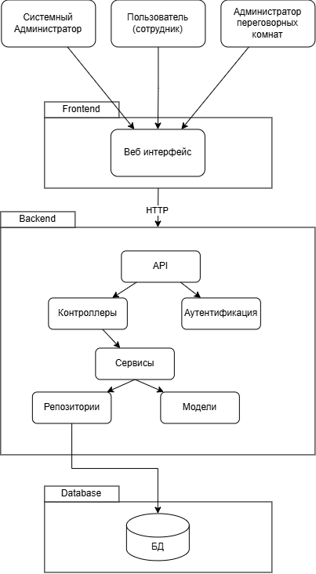
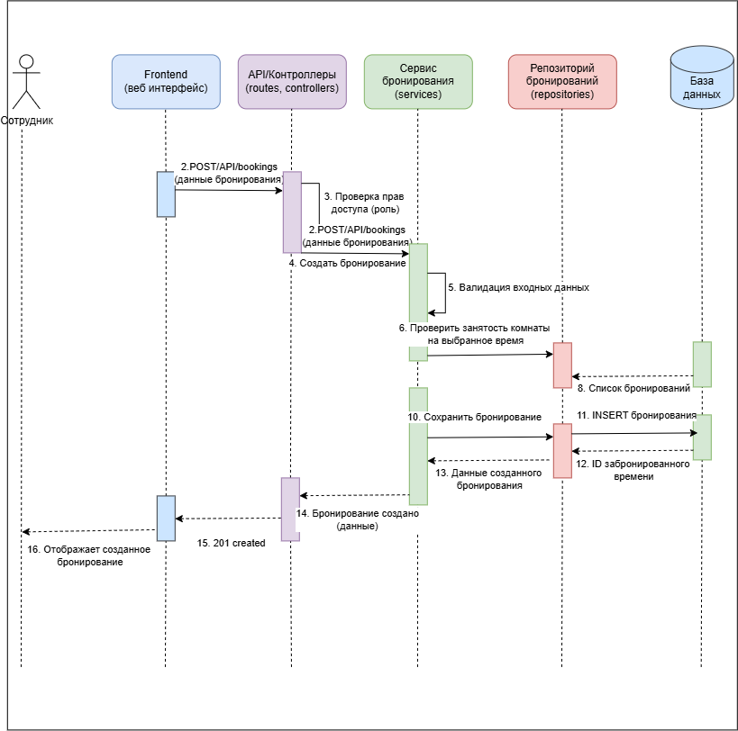

# Лабораторная работа №3

## Проектирование архитектуры информационной системы

**Предметная область:** система бронирования переговорных комнат.

## Цель работы

Изучить принципы проектирования архитектуры информационных систем, определить структуру приложения, спроектировать взаимодействие между основными компонентами и подготовить структуру программного проекта для дальнейшей разработки.

## 1. Архитектура приложения

Для системы выбрана трёхуровневая клиент-серверная архитектура:

- Frontend - является клиентской частью системы. Пользователь работает с ним через браузер: просматривает переговорные комнаты, выбирает дату и время, создаёт и отменяет бронирования.

- Backend - является серверной частью системы. Он получает запросы от Frontend, проверяет права пользователя, выполняет основную логику и обращается к базе данных.

- Database - используется для хранения информации о пользователях, переговорных комнатах и бронированиях.

## 2. Компоненты системы

| Компонент | Назначение и ответственность |
|---|---|
| Веб-интерфейс (Frontend) | Отображение переговорных комнат, расписания и форм бронирования, отправка запросов к API |
| API | Приём HTTP-запросов от Frontend и передача их серверной части |
| Контроллеры | Разбор запросов, вызов нужных сервисов и формирование ответа |
| Сервис бронирования | Создание и отмена бронирований, проверка занятости комнаты на выбранное время |
| Сервис управления комнатами | Работа с информацией о переговорных комнатах, их вместимости, оборудовании и статусе |
| Репозитории | Получение и сохранение данных в базе данных |
| Модуль аутентификации | Проверка пользователя, его роли и доступных действий |
| База данных | Хранение пользователей, переговорных комнат и бронирований |

## 3. Взаимодействие компонентов

Общая последовательность обработки запроса пользователя на создание бронирования:

1. Сотрудник выбирает переговорную комнату, дату и время во веб-интерфейсе.
2. Frontend отправляет HTTP-запрос на Backend через API.
3. API принимает запрос и передаёт его контроллеру.
4. Контроллер вызывает сервис бронирования.
5. Сервис бронирования проверяет данные и обращается к репозиторию, чтобы получить существующие бронирования выбранной комнаты.
6. Репозиторий выполняет запрос к базе данных и возвращает найденные бронирования.
7. Сервис проверяет, не пересекается ли выбранное время с уже существующими бронированиями.
8. Если комната свободна, новое бронирование сохраняется в базе данных.
9. Результат возвращается через API во Frontend и отображается пользователю.

## 4. Структура проекта

Для будущей реализации системы подготовлена следующая структура:

```text
lab3/
├── frontend/             # клиентская часть
├── backend/              # серверная часть
│   ├── controllers/      # обработка HTTP-запросов
│   ├── services/         # основная логика системы
│   ├── repositories/     # доступ к данным
│   ├── models/           # модели данных
│   └── routes/           # API-маршруты
├── database/             # схема базы данных / данные
├── diagrams/             # диаграммы архитектуры и взаимодействия
└── README.md             # описание лабораторной работы

## 5. Индивидуальная особенность предметной области

В системе выделена нетипичная особенность — проверка занятости переговорной комнаты на выбранные дату и время перед созданием бронирования. Проверка выполняется на стороне Backend сервисом бронирования и нужна для того, чтобы избежать двойного бронирования одной комнаты.

## 6. API системы

Для взаимодействия Frontend и Backend используется REST API. Через него клиентская часть передаёт серверу запросы на получение информации о переговорных комнатах и работу с бронированиями.

Например, через API система может получить список комнат, найти свободную комнату, создать новое бронирование или отменить существующее. Frontend не обращается к базе данных напрямую, все операции выполняются через Backend.

Примеры запросов:

- GET /api/rooms — получить список переговорных комнат
- POST /api/bookings — создать бронирование
- DELETE /api/bookings/ — отменить бронирование

## 7. Диаграмма архитектуры

Диаграмма показывает основные части системы и связи между ними. Пользователь работает с Frontend, клиентская часть передаёт запросы в Backend через API, а серверная часть выполняет обработку и обращается к базе данных.

Внутри Backend показаны контроллеры, сервисы и репозитории.



## 8. Диаграмма взаимодействия компонентов

На диаграмме взаимодействия показан сценарий создания бронирования переговорной комнаты.

В сценарии участвуют:

- сотрудник
- Frontend
- API / контроллер
- сервис бронирования
- репозиторий
- база данных

При создании бронирования сервис сначала получает существующие бронирования комнаты и проверяет пересечение по времени. Если комната свободна, новое бронирование сохраняется. Если выбранное время уже занято, система возвращает пользователю сообщение о невозможности создать бронирование.



## Вывод

В ходе лабораторной работы была спроектирована архитектура информационной системы бронирования переговорных комнат. Для системы выбрана трёхуровневая клиент-серверная архитектура с разделением на Frontend, Backend и базу данных.

Были определены основные компоненты системы, описано их взаимодействие и подготовлена структура проекта. Также была выделена особенность предметной области — проверка занятости переговорной комнаты перед созданием бронирования. Взаимодействие клиентской и серверной частей выполняется через REST API.